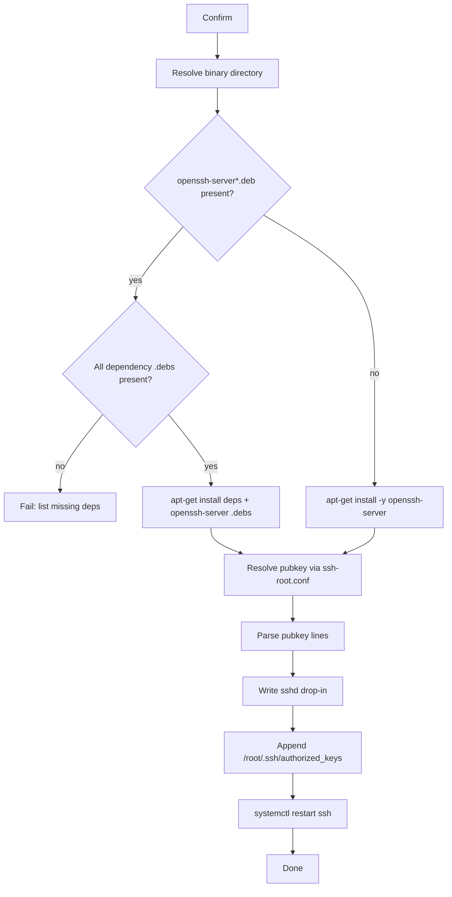

# debian-network-tui

A terminal UI for managing `/etc/network/interfaces` on **Debian 11 / 12 / 13**.
Written in Go, with an **nmtui-like** workflow for **ifupdown** (including `source` / `source-directory`).

All UI text is English so it works on minimal installs without CJK fonts.

**中文说明：[README_ZH.md](README_ZH.md)**

## Screenshots

### Main menu


### Add bond (select UP NICs as slaves)


## Features

- Lists **all system interfaces** (not only ones already in the config file)
- Edit connections: add / modify / delete iface stanzas
- Connection types: **Ethernet**, **VLAN**, **Bond**
- VLAN on ethernet **or on bond** (`bond0.100` with `vlan-raw-device bond0`)
- Bond: slaves, mode (802.3ad / active-backup / …), miimon, LACP rate; slaves auto-written as `manual` + `bond-master`
- IPv4: `dhcp` / `static` / `manual` / disabled
- IPv6: `disabled` / `dhcp` / `static` / `auto` (`manual` + `accept_ra 1`)
- DNS via dedicated editor for `/etc/resolv.conf` (nameservers + search)
- One-click overwrite of `/etc/resolv.conf` from a local file next to the binary
- One-shot setup: DNS overwrite + clear/apply apt + bond/vlan debs + SSH (with live log)
- `auto` and `allow-hotplug` toggles
- Activate / deactivate via `ifup` / `ifdown`
- Automatic backup before save

No NetworkManager dependency — suitable for servers and minimal installs.

## Requirements

- Go 1.21+ (build time only)
- Runtime: `ifupdown` (`ifup`/`ifdown`), `iproute2` (`ip`)
- Root privileges (read/write `/etc/network/interfaces`)

## Download

Get binaries and the setup ISO from [GitHub Releases](https://github.com/Songxwn/Debian-network-tui/releases):

```bash
# amd64 tarball
tar -xzf debian-network-tui-v0.3.11-linux-amd64.tar.gz
sudo install -m 755 debian-network-tui-v0.3.11-linux-amd64 /usr/local/bin/debian-network-tui
```

### Setup ISO

Each release also publishes `debian-network-tui-<version>.iso` containing:

- `debian-network-tui` (linux amd64) plus other arches under `bin/`
- Example configs: `resolv.conf`, `sources.list`, `ssh-root.conf`, `root.pub`
- `packages/README.txt` — where to put `ifenslave` / `vlan` / `net-tools` `.deb` files

```bash
mkdir -p /mnt/dntui /root/dntui-setup
mount -o loop debian-network-tui-v0.3.11.iso /mnt/dntui
cp -a /mnt/dntui/. /root/dntui-setup/
umount /mnt/dntui
# Edit /root/dntui-setup/root.pub and add ifenslave_*.deb + vlan_*.deb + net-tools_*.deb, then:
cd /root/dntui-setup && sudo ./debian-network-tui
```

Pushing a `v*` tag triggers GitHub Actions to build binaries, the ISO, and publish a Release.

## Build

```bash
git clone https://github.com/Songxwn/Debian-network-tui.git
cd Debian-network-tui
go mod tidy
make build
# output: bin/debian-network-tui
```

Cross-compile:

```bash
make cross
# bin/debian-network-tui-linux-amd64
# bin/debian-network-tui-linux-arm64
```

## Usage

```bash
sudo debian-network-tui
```

Override config path (for testing):

```bash
sudo INTERFACES_FILE=/tmp/interfaces debian-network-tui
```

Idle timeout: exits after **300 seconds** without keyboard input.
Override with `IDLE_TIMEOUT_SEC` (set `0` to disable):

```bash
sudo IDLE_TIMEOUT_SEC=60 debian-network-tui
```

### Key bindings

| Screen       | Keys |
|--------------|------|
| Main menu    | `Up/Down` select, `Enter` confirm, `q` quit |
| Connection list | `a` add, `d` delete, `Enter` edit, `Esc` back |
| Edit form    | `Tab` next field, `Space` select/toggle (VLAN parent / bond slaves), `Left/Right` change, `Ctrl+S` save, `Esc` cancel |
| Confirm      | `y` / `n` |

### Main menu (nmtui-like)

1. **Edit a connection** — edit interfaces config
2. **Edit DNS (/etc/resolv.conf)** — nameservers and search domains (`Ctrl+O` to overwrite from local file)
3. **Apply DNS from file (overwrite)** — copy `resolv.conf` / `dns.conf` / `dns-resolv.conf` next to the binary over `/etc/resolv.conf` (backs up first)
4. **Activate a connection** — `ifup <iface>`
5. **Deactivate a connection** — `ifdown <iface>`
6. **Restart networking** — `systemctl restart networking`
7. **Clear all connections** — wipe all ifaces except `lo` (backs up first)
8. **Install ifenslave/vlan/net-tools (.deb)** — find `ifenslave_*.deb` / `vlan_*.deb` / `net-tools_*.deb` next to the binary and `apt-get install -y` them
9. **Clear apt sources** — empty `/etc/apt/sources.list` and remove `sources.list.d` drop-ins (backs up first)
10. **Apply apt sources from file** — read `sources.list` / `*.list` / `*.sources` next to the binary and install them under `/etc/apt/`
11. **Configure SSH server (root key)** — install `openssh-server` (local `.deb` or apt), enable root key login, import pubkey
12. **One-shot setup (DNS, apt, bond/vlan, SSH)** — run the above file-based steps in order with a live log screen (requires all local files present)
13. **Quit**

Place matching `.deb` files in the same directory as `debian-network-tui` before using option 8.

For DNS overwrite (option 3) or one-shot (option 12), place beside the binary one of: `resolv.conf`, `dns-resolv.conf`, `dns.conf` (see `examples/resolv.conf`).

For SSH setup (option 11) or one-shot (option 12), place beside the binary:

- `openssh-server_*.deb` (optional; otherwise apt is used)
- **Required with local openssh-server** (same suite/version):
  - `openssh-client_*.deb`
  - `openssh-sftp-server_*.deb`
  - `runit-helper_*.deb`
  - `libssl3_*.deb`
  - `libwrap0_*.deb`
- `ssh-root.conf` (optional) with `PubkeyFile=root.pub`
- `root.pub` — your OpenSSH public key (see `examples/`)

### SSH setup — internal logic

After confirming **Configure SSH server (root key)**, the tool runs this pipeline (`internal/sshsetup`):



1. **Install** — scan the binary directory for `openssh-server*.deb`. If found, also require and install local dependency `.deb` files (`openssh-client`, `openssh-sftp-server`, `runit-helper`, `libssl3`, `libwrap0`) in one `apt-get install`; otherwise `apt-get install -y openssh-server`.
2. **Pubkey** — read optional `ssh-root.conf` (`PubkeyFile=...`), else try `root.pub` / `id_rsa.pub` / `id_ed25519.pub` / `authorized_keys`. Only valid OpenSSH pubkey lines are used.
3. **sshd** — write `/etc/ssh/sshd_config.d/99-debian-network-tui-rootkey.conf` with `PermitRootLogin prohibit-password`, `PubkeyAuthentication yes`, `AuthorizedKeysFile .ssh/authorized_keys` (root key-only login; no password).
4. **authorized_keys** — ensure `/root/.ssh` (`700`), append missing keys to `/root/.ssh/authorized_keys` (`600`), never wipe existing keys.
5. **Restart** — `systemctl restart ssh`, fallback `sshd`, then `service ssh restart`.

**Security:** ensure `root.pub` is yours; after `prohibit-password`, root password login is disabled.

For options 8–9, place an apt sources file next to the binary (see `examples/sources.list`):

- `sources.list` or `apt-sources.list` → `/etc/apt/sources.list`
- `*.list` / `*.sources` → `/etc/apt/sources.list.d/`
- or files under `sources.list.d/` beside the binary

## Example: bond + VLAN

```
auto bond0
iface bond0 inet manual
    bond-slaves eth0 eth1
    bond-mode 802.3ad
    bond-miimon 100
    bond-lacp-rate fast

auto eth0
iface eth0 inet manual
    bond-master bond0

auto eth1
iface eth1 inet manual
    bond-master bond0

allow-hotplug bond0.100
iface bond0.100 inet static
    vlan-raw-device bond0
    vlan_id 100
    address 10.10.10.2
    netmask 255.255.255.0
    gateway 10.10.10.1
```

Requires `ifenslave` (bonding), `vlan`, and `net-tools` on Debian:

```bash
sudo apt-get install -y ifenslave vlan net-tools
```

## Example config (ethernet)

After saving a static IPv4 connection:

```
# Managed by debian-network-tui: eth0
allow-hotplug eth0
iface eth0 inet static
    address 192.168.1.10
    netmask 255.255.255.0
    gateway 192.168.1.1
```

DNS is configured separately in `/etc/resolv.conf` via **Edit DNS**.
## Notes

- After editing, use **Activate a connection**, or run `ifup <iface>` / `systemctl restart networking`
- Deactivating the active NIC over SSH may disconnect you
- `lo` cannot be deleted
- Writes update the main config file; connections that only exist under `interfaces.d/` are visible, but edits are merged into the main file (clean up old sourced snippets manually if needed)

## Test

```bash
go test ./...
```

## License

MIT
