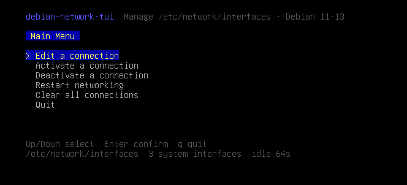
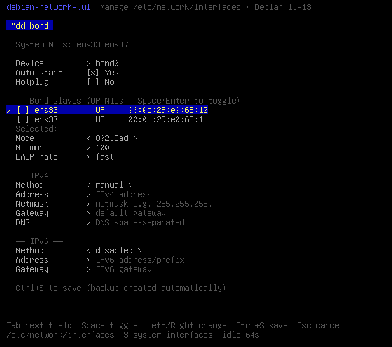
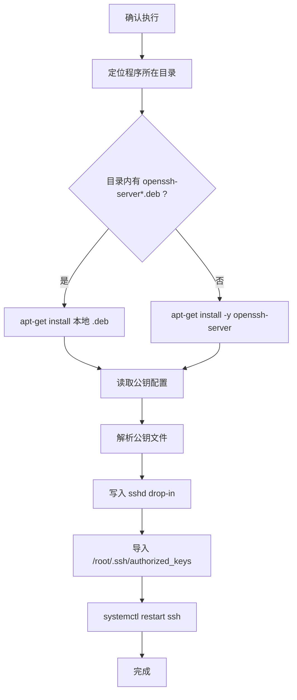

# debian-network-tui

面向 **Debian 11 / 12 / 13** 的终端网卡管理工具，用 Go 编写，交互类似 `nmtui`，直接管理 **ifupdown** 的 `/etc/network/interfaces`（含 `source` / `source-directory`）。

界面文案为英文，便于在无中文字体的最小化系统上正常显示。

[English README](README.md)

## 截图

### 主菜单



### 创建 Bond（勾选已 UP 网卡作为 slave）



## 功能

- 列出**全部系统网卡**（不仅限于配置文件中已有项）
- 编辑连接：新建 / 修改 / 删除 iface
- 连接类型：**Ethernet**、**VLAN**、**Bond**
- 可在以太网或 **Bond 上建 VLAN**（如 `bond0.100`）
- Bond：从已 UP 网卡勾选 slaves，支持模式 / miimon / LACP；自动为 slave 写入 `manual` + `bond-master`
- VLAN：从已 UP 网卡/bond 选择 Parent，VLAN ID 范围 **2–4094**
- IPv4：`dhcp` / `static` / `manual` / disabled（新建默认 disabled）
- IPv6：`disabled` / `dhcp` / `static` / `auto`
- 独立编辑 DNS：`/etc/resolv.conf`
- 一键用本地配置文件覆盖 `/etc/resolv.conf`
- 一键执行：覆盖 DNS + 清空/应用 apt 源 + 安装 ifenslave/vlan + 配置 SSH（带实时日志）
- `auto`、`allow-hotplug`
- 激活 / 停用：`ifup` / `ifdown`
- 重启网络服务
- 清空全部网卡配置（保留 `lo`，先备份）
- 本地安装 `ifenslave` / `vlan` 的 `.deb`
- 清空 / 应用 apt 源（从程序目录读取配置文件）
- 配置 SSH：安装 openssh-server、允许 root 密钥登录、导入公钥
- 保存前自动备份；空闲 **65 秒**无操作自动退出

不依赖 NetworkManager，适合服务器与最小化安装。

## 依赖

- 编译：Go 1.21+
- 运行：`ifupdown`、`iproute2`
- 需要 root 权限

## 下载

从 [GitHub Releases](https://github.com/Songxwn/Debian-network-tui/releases) 下载：

```bash
# amd64 示例（版本号按 Release 实际修改）
tar -xzf debian-network-tui-v0.3.5-linux-amd64.tar.gz
sudo install -m 755 debian-network-tui-v0.3.5-linux-amd64 /usr/local/bin/debian-network-tui
```

推送 `v*` 标签后，GitHub Actions 会自动编译并发布。

## 编译

```bash
git clone https://github.com/Songxwn/Debian-network-tui.git
cd Debian-network-tui
go mod tidy
make build
# 产物: bin/debian-network-tui
```

交叉编译：

```bash
make cross
```

## 使用

```bash
sudo debian-network-tui
```

测试用配置路径：

```bash
sudo INTERFACES_FILE=/tmp/interfaces debian-network-tui
sudo RESOLV_CONF=/tmp/resolv.conf debian-network-tui
```

空闲超时默认 65 秒，可用环境变量调整（`0` 关闭）：

```bash
sudo IDLE_TIMEOUT_SEC=120 debian-network-tui
```

### 快捷键

| 界面 | 按键 |
|------|------|
| 主菜单 | `↑/↓` 选择，`Enter` 确认，`q` 退出 |
| 连接列表 | `a` 新建，`d` 删除，`Enter` 编辑，`Esc` 返回 |
| 编辑表单 | `Tab` 切换，`Space` 勾选（VLAN Parent / Bond slaves），`←/→` 改选项，`Ctrl+S` 保存，`Esc` 取消 |
| 确认框 | `y` / `n` |

### 主菜单

1. **Edit a connection** — 编辑网卡配置
2. **Edit DNS (/etc/resolv.conf)** — 编辑 DNS（`Ctrl+O` 可从本地文件覆盖）
3. **Apply DNS from file (overwrite)** — 用二进制同目录的 `resolv.conf` / `dns.conf` 等覆盖系统 DNS（先备份）
4. **Activate a connection** — `ifup`
5. **Deactivate a connection** — `ifdown`
6. **Restart networking** — 重启网络服务
7. **Clear all connections** — 清空网卡配置（保留 lo）
8. **Install ifenslave/vlan (.deb)** — 安装本地 deb
9. **Clear apt sources** — 清空 apt 源
10. **Apply apt sources from file** — 从文件应用 apt 源
11. **Configure SSH server (root key)** — 配置 SSH 与 root 密钥登录
12. **One-shot setup (DNS, apt, bond/vlan, SSH)** — 按顺序一键执行上述文件化步骤，并显示实时日志（需本地文件齐全）
13. **Quit** — 退出

### 本地文件约定（与二进制同目录）

**一键部署（菜单 12）所需文件：** DNS + APT + Bond/VLAN deb + SSH 公钥（见下方各项）。

**DNS（菜单 3 / 12）：**

- `resolv.conf` / `dns-resolv.conf` / `dns.conf` → 覆盖 `/etc/resolv.conf`
- 示例：`examples/resolv.conf`

**Bond/VLAN 包（菜单 8 / 12）：**

- `ifenslave_*.deb`
- `vlan_*.deb`

**APT 源（菜单 9–10 / 12）：**

- `sources.list` 或 `apt-sources.list` → `/etc/apt/sources.list`
- `*.list` / `*.sources` → `/etc/apt/sources.list.d/`
- 示例：`examples/sources.list`

**SSH（菜单 11 / 12）：**

- `openssh-server_*.deb`（可选，没有则走 apt）
- `ssh-root.conf`（可选）：

```ini
PubkeyFile=root.pub
```

- `root.pub`：OpenSSH 公钥内容  
  示例：`examples/ssh-root.conf`、`examples/root.pub`

### SSH 配置内部逻辑说明

菜单项 **Configure SSH server (root key)** 确认后，按以下顺序执行（实现见 `internal/sshsetup`）：



#### 1. 安装 openssh-server

1. 取当前可执行文件所在目录（解析符号链接后）。
2. 扫描该目录下文件名包含 `openssh-server`（或同时包含 `openssh` 与 `server`）的 `.deb`。
3. **若找到本地包**：`apt-get install -y --allow-downgrades <deb路径...>`（`DEBIAN_FRONTEND=noninteractive`）。
4. **若未找到**：`apt-get install -y openssh-server`（依赖当前 apt 源可用）。

#### 2. 解析公钥来源

优先读取同目录下的 `ssh-root.conf`（可选）：

| 配置键（不区分大小写） | 含义 |
|------------------------|------|
| `PubkeyFile` / `Pubkey` / `PublicKeyFile` | 公钥文件路径（相对程序目录或绝对路径） |

未配置或文件不存在时，按顺序尝试：

1. `PubkeyFile` 指定路径  
2. `root.pub`  
3. `id_rsa.pub`  
4. `id_ed25519.pub`  
5. `authorized_keys`  

任一存在即采用；全部缺失则报错退出（不继续改 sshd）。

公钥文件中：跳过空行与 `#` 注释；仅接受以 `ssh-rsa`、`ssh-ed25519`、`ecdsa-sha2-*` 等类型开头的行。

#### 3. 配置 sshd（root 仅密钥登录）

写入 drop-in（不直接改主配置，便于卸载/覆盖）：

路径：`/etc/ssh/sshd_config.d/99-debian-network-tui-rootkey.conf`

```
PermitRootLogin prohibit-password
PubkeyAuthentication yes
AuthorizedKeysFile .ssh/authorized_keys
```

含义：

- `prohibit-password`：允许 root 远程登录，但**禁止密码**，只接受公钥。
- 依赖 Debian 默认 `Include /etc/ssh/sshd_config.d/*.conf`。

#### 4. 导入 root 公钥

1. 确保目录 `/root/.ssh` 存在，权限 `700`。
2. 读取已有 `/root/.ssh/authorized_keys`，按完整行去重。
3. 将新公钥**追加**写入（不删除原有密钥）。
4. 文件权限设为 `600`。

#### 5. 重启服务

依次尝试：

1. `systemctl restart ssh`（Debian 单元名）  
2. 失败则 `systemctl restart sshd`  
3. 无 systemctl 时：`service ssh restart`  

任一步失败会返回错误（此时包与配置可能已写入，需人工检查）。

#### 安全提示

- 请确认 `root.pub` 中是你自己的公钥，误导入他人密钥等于开放 root。
- `prohibit-password` 后 root **不能再用密码**登录；请先保证密钥可用或保留其他管理员账号。
- 若系统使用云镜像自定义 sshd，请确认 `sshd_config.d` 会被加载。

## 配置示例：Bond + VLAN

```
auto bond0
iface bond0 inet manual
    bond-slaves eth0 eth1
    bond-mode 802.3ad
    bond-miimon 100
    bond-lacp-rate fast

auto eth0
iface eth0 inet manual
    bond-master bond0

auto eth1
iface eth1 inet manual
    bond-master bond0

allow-hotplug bond0.100
iface bond0.100 inet static
    vlan-raw-device bond0
    vlan_id 100
    address 10.10.10.2
    netmask 255.255.255.0
    gateway 10.10.10.1
```

需要软件包：

```bash
sudo apt-get install -y ifenslave vlan
```

也可在菜单中用本地 `.deb` 安装。

## 注意事项

- 改配置后请使用「激活连接」或「重启网络服务」
- 远程 SSH 下停用当前网卡可能导致断连
- 不能删除 `lo`
- 写入主要更新主配置文件；仅存在于 `interfaces.d/` 的条目编辑后会合并进主文件
- DNS 与网卡配置分离，请用「Edit DNS」修改 `/etc/resolv.conf`
- SSH 会设置 `PermitRootLogin prohibit-password`（仅允许密钥登录 root）

## 测试

```bash
go test ./...
```

## 许可证

MIT
